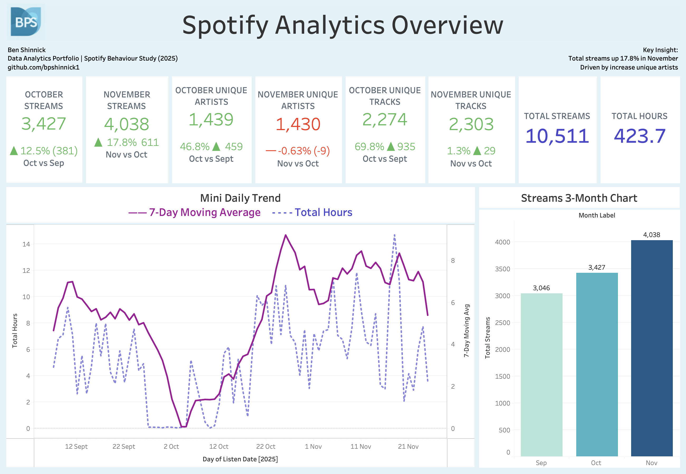
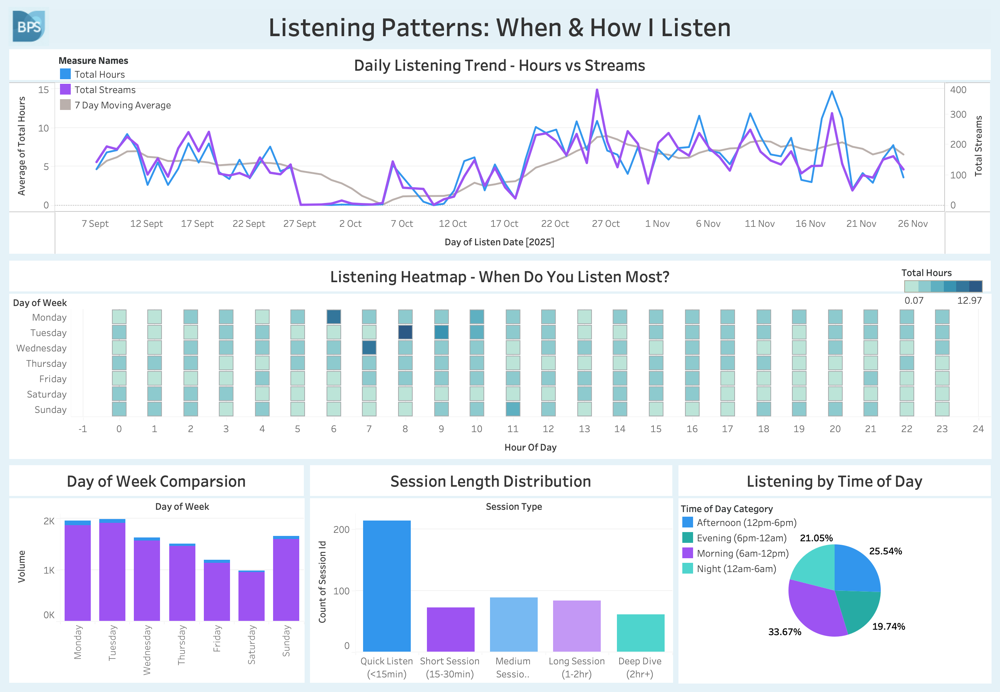
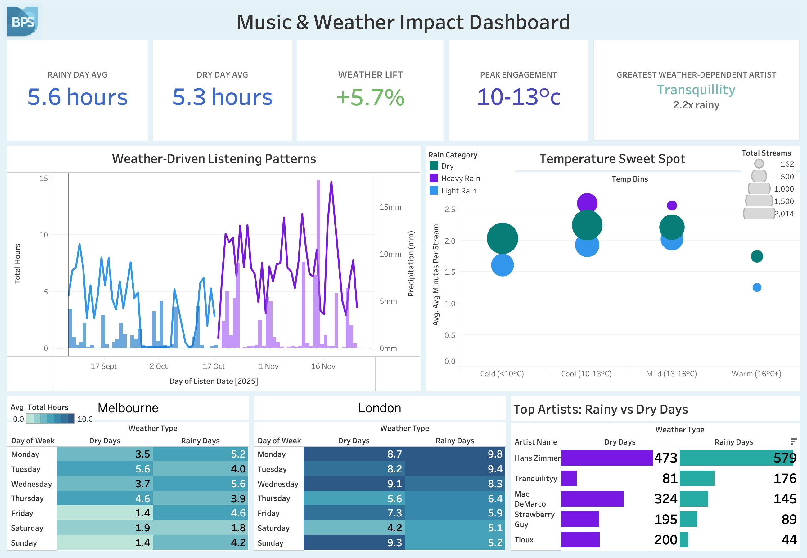

# spotify-analytics
Spotify listening behaviour analysis with weather impact
# Spotify Analytics & Weather Impact Dashboard

## Project Overview
End-to-end analytics project analysing 10,511 Spotify listening records (Sep–Dec 2025), enriched with weather data to understand how listening behaviour varies across time, artists, and environmental conditions.

The project demonstrates data modelling, SQL-based feature engineering, and dashboard storytelling using PostgreSQL and Tableau.

---

## Dataset
- 10,511 Spotify listening events
- 816 unique artists
- 2,046 unique tracks
- 423.7 total listening hours
- Timestamp-level granularity

---

## Tech Stack
- **PostgreSQL** – data storage, aggregation, feature engineering  
- **SQL** – summary tables, behavioural analysis, weather integration  
- **Tableau** – dashboards and visual analytics  

---

## Dashboard 1 — Overview

**Purpose:**  
Provide a high-level summary of listening behaviour and engagement.

**Key Insights:**
- Listening time increases from mid-October, suggesting seasonal or routine-driven changes
- High artist diversity relative to total streams
- Average listening duration per stream remains stable across the period

---

## Dashboard 2 — Listening Patterns

**Purpose:**  
Analyse *when* listening occurs across days and hours.

**Key Insights:**
- Clear weekday listening routines, with peaks in morning and evening hours
- Hour × weekday heatmap reveals consistent behavioural rhythms
- Listening patterns differ between weekdays and weekends

---

## Dashboard 3 — Artists & Weather Impact

**Purpose:**  
Understand content preferences and how external factors influence listening behaviour.

**Key Insights:**
- Higher listening duration on rainy days
- Lower-energy and acoustic tracks are more common during poor weather
- Warmer temperatures correlate with longer listening sessions

---

## Data Modelling Notes
- Raw data retained at timestamp-level granularity
- Summary tables created at daily, hourly, artist, and track levels
- Hour × weekday analysis required rebuilding hourly summaries at the correct grain
- Weather data joined at daily level to avoid aggregation bias

---

## Repository Structure

spotify-analytics/
│
├── data/
├── sql/
├── tableau/
├── screenshots/
└── README.md

---

## Future Improvements
- Extend weather analysis with additional external variables
- Apply statistical testing to validate observed correlations
- Automate data refresh and dashboard updates

